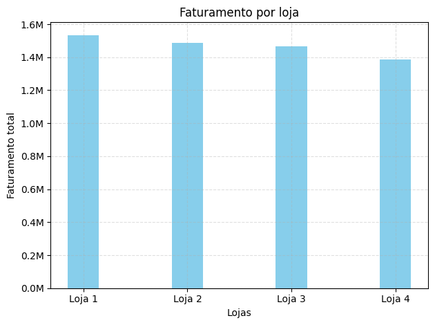
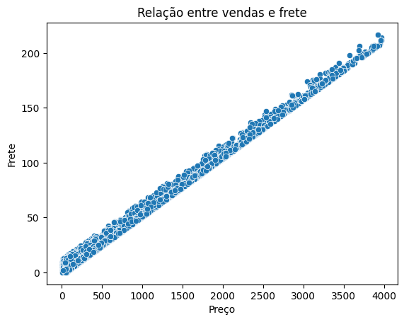
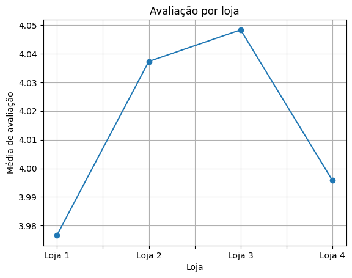

# Análise Exploratória (EDA) de vendas e desempenho das lojas do Sr. João

   

## 📋 Sobre o Projeto

**Challenge de Data Science** da Turma 9 do Programa ONE (Oracle Next Education + Alura Latam).

O objetivo principal é realizar uma Análise Exploratória de Dados (EDA) para resolver um problema de negócio estratégico: o Sr. João, dono de uma rede varejista, precisa identificar qual de suas quatro lojas apresenta o desempenho inferior para vendê-la e reinvestir o capital.

Para isso, foram analisados quatro *datasets* individuais (um para cada loja) contendo histórico de vendas, informações de produtos, avaliações de clientes e dados logísticos.

## 🛠️ Tecnologias e Ferramentas Utilizadas

O projeto foi desenvolvido em Python, utilizando as seguintes bibliotecas para análise e visualização de dados:

* **Pandas:** Coleta, limpeza, manipulação e concatenação dos dados.
* **Matplotlib & Seaborn:** Criação de visualizações gráficas (estáticas e estatísticas) para identificação de padrões e *insights*.
* **Jupyter Notebook / VS Code:** Ambiente de desenvolvimento interativo.

## 📊 Análise e Principais Insights

A investigação foi guiada pelas seguintes métricas-chave: Faturamento, Categorias de Produtos, Avaliação dos Clientes, Produtos mais ou menos vendidos e Frete Médio.

### 1. Faturamento Total por Loja
A primeira etapa foi consolidar os dados e verificar a receita total gerada por cada unidade. A análise revelou uma disparidade de desempenho.

*Como observado no gráfico, a Loja 4 apresenta o menor faturamento acumulado, com uma diferença de mais de R$ 150 mil em relação à loja líder.*

### 2. Desempenho por Categoria
Investigando a fundo, foi verificado se a baixa performance se repetia nas principais categorias de produtos.

*A Loja 4 demonstrou desempenho inferior nas categorias "carro-chefe" da empresa, como Eletrônicos e Eletrodomésticos.*

Percentual das categorias

#### 3. Produtos mais ou menos vendidos
Decidi investigar os 10 produtos mais vendidos para facilitar a visualização

A participação na venda dos produtos mais vendidos:

A participação na venda dos produtos menos vendidos:

### 4. Frete Médio
Uma descoberta interessante ocorreu ao cruzar os dados de logística com o valor dos produtos. Inicialmente, notou-se que a Loja 4 possuía o frete médio mais barato.

*A análise de dispersão confirmou uma forte correlação linear: produtos mais caros têm fretes mais caros. Concluiu-se que a Loja 4 tem o frete mais barato não por eficiência, mas porque vende produtos de menor valor agregado (Ticket Médio mais baixo), o que impacta diretamente seu faturamento total.*

### 5. Avaliação dos Clientes (Satisfação)
Apesar do menor desempenho financeiro, a satisfação do cliente não é um problema crítico para a Loja 4.

*A distribuição das notas mostra que a Loja 4 mantém uma média de avaliações competitiva, superando inclusive a loja de maior faturamento em satisfação.*

## 🎯 Conclusão e Recomendação

Com base na Análise Exploratória de Dados, a **Loja 4** foi identificada como a unidade com o desempenho financeiro inferior.

Embora a loja mantenha bons níveis de satisfação do cliente e um frete competitivo, seu faturamento é prejudicado por um mix de vendas focado em produtos de menor valor (baixo ticket médio), incapaz de gerar o volume de receita observado nas outras unidades.

**Recomendação Estratégica:**
Seguindo o objetivo de negócio estabelecido, recomenda-se a **venda da Loja 4** para que o Sr. João possa capitalizar o ativo de menor retorno e realizar novos investimentos.

## 📂 Como Executar o Projeto

1. Clone este repositório.
2. Certifique-se de ter as bibliotecas necessárias instaladas (`pandas`, `matplotlib`, `seaborn`).
3. Navegue até a pasta `notebooks` e execute o arquivo `analise_lojas.ipynb`.
4. Os dados brutos estão disponíveis na pasta `data`.
